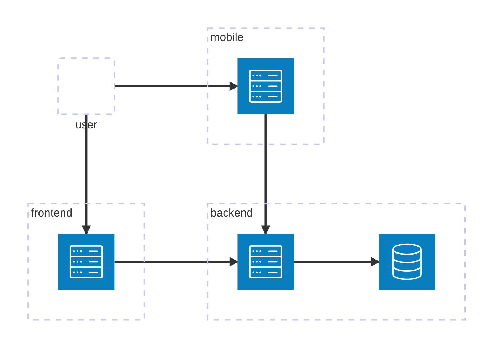

# Estancias del Sol

Este proyecto fue desarrollado por alumnos de la Facultad de Ingeniería de Buenos Aires, en la materia de Introducción al Desarrollo de Software. El objetivo principal es diseñar un software para una cadena de hoteles en Argentina. El sistema incluye un sitio web que ofrece información detallada sobre las distintas ubicaciones, permite consultar la disponibilidad de habitaciones según las fechas seleccionadas y brinda la opción de realizar reservas. Adicionalmente, se ha creado una aplicación móvil que complementa el sitio web, permitiendo a los huéspedes contratar servicios adicionales ingresando su número de reserva y apellido.

## Diagrama de arquitectura

## Tecnologías usadas

- Flask
- HTML
- CSS
- Javascript
- MySQL
- Kivy
